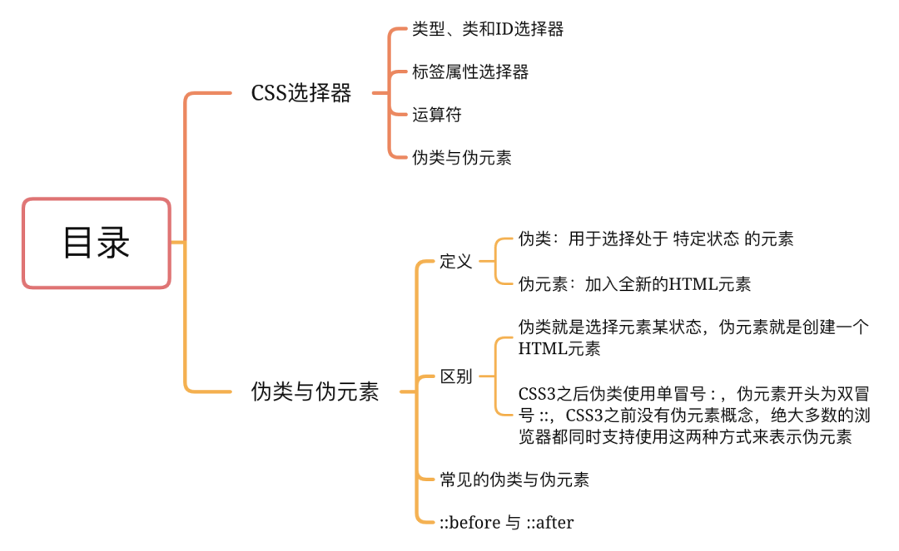
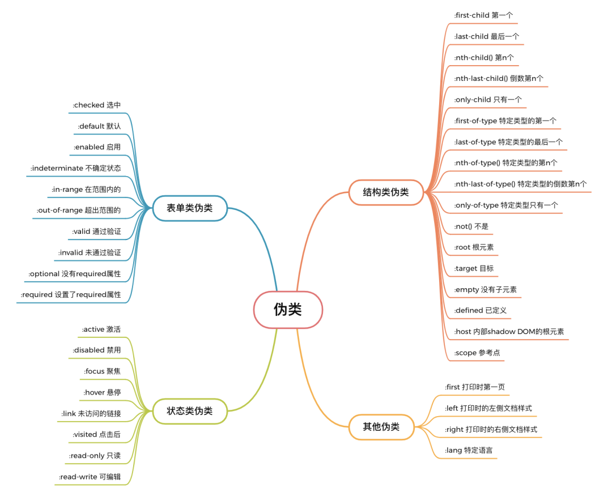
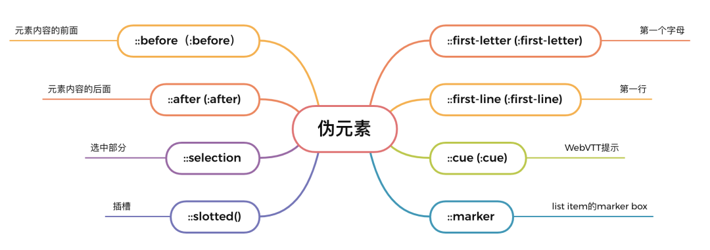

# 伪类与伪元素

## 目录


## CSS 选择器

想要了解伪类与伪元素，我们不得不提到 CSS 选择器，CSS 选择器是元素和其他部分组合起来，告诉浏览器哪个 HTML 元素应当是被选为应用规则中的 CSS 属性值的方式

选择器的种类有：

- 类型、类和ID选择器
- 标签属性选择器
- 运算符
- 伪类与伪元素

### 类型、类和ID选择器

```css
h1 { } /* 类型选择器 */
.box { } /* 类选择器 */
#unique { } /* ID选择器 */
```
### 标签属性选择器
这组选择器根据一个元素上的某个标签属性是否存在来选择：

```css
a[title] { }
```
或者根据标签属性是否是特定值来选择：
```css
a[href="https://example.com"] { }
```

### 运算符
这种选择器可以将其他选择器组合起来，更复杂的选择元素。下面的示例就是利用运算符`（>）`选择了`<article> `元素的初代子元素
```css
article > p { }
```

## 伪类与伪元素

> 什么是伪类？什么是伪元素？
- 伪类：用于选择处于 特定状态 的元素，比如鼠标悬浮状态（ :hover ）。它们表现得会像是你向你的文档的某个部分应用了一个类一样，帮你在你的标记文本中减少多余的类，让你的代码更灵活、更易于维护。
- 伪元素：以类似方式表现，不过表现得是像你往标记文本中加入全新的HTML元素一样，产生的效果是把不存在的元素硬选出来

> 伪类与伪元素的区别

### 表现方式区别：
伪类表现的是某种状态被选择出来，例如` :hover 、 :checked` ，而伪元素表现的是选择元素的某个部分，使这部分看起来像一个独立的元素，其实并不是，例如 `::before 、 ::after`
抽象的说，伪类就是选择元素某状态，伪元素就是创建一个HTML元素

### 符号区别
伪类使用单冒号` : `，伪元素开头为双冒号` :: `，单需要注意的是 CSS3 之前并没有定义伪元素，都统称为伪类，所以目前绝大多数的浏览器都同时支持使用这两种方式来表示伪元素


> 常见的伪类与伪元素
### 伪类：



### 伪元素：



## ::before 与 ::after

接下来我们说说最常用、最经典的 `::before` 和 `::after`伪元素， `::before` 表示在元素内容之前插入一个虚拟的元素， `::after`则表示在元素内容之后插入，并且 `::before` 和 `::after`中支持所有的 CSS 属性。

但需要注意的是这两个伪元素所在的 CSS 规则必须指定 `content` 属性才会生效
### content 属性
`content` 可取string、attr()、url()/uri()：

#### string
```css
<p>Hello Nuage</p>
<style>
  p::before{
    content: "❤️";
    color: red;
  }
  p::after{
    content: "❤️";
    color: red;
  }
</style>
```
#### attr()
```css
<a href="xxx">❤️Hello Nuage❤️</a>
<style>
  a::after {
    content: ' → ' attr(href); /* 在 href 前显示一个箭头 */
  }
</style>
```
#### url()/uri()
```css
<p>❤️Hello Nuage❤️</p>
<style>
  p::after {
    content: url("xxx.jpg"); /* p后面显示一张图片 */
  }
</style>
```

这两个伪元素常用于一些修饰性元素，以纯 CSS 代码添加进去，就能很好地保持 HTML 代码中的语义，既完成了显示效果，又不会让 DOM 中出现很多无语义的空元素