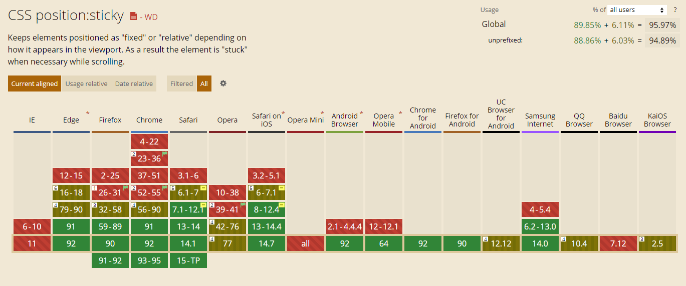

# position: sticky

position:sticky是css定位新增属性；可以说是相对定位relative和固定定位fixed的结合；它主要用在对scroll事件的监听上；简单来说，在滑动过程中，某个元素距离其父元素的距离达到sticky粘性定位的要求时(比如top：100px)；position:sticky这时的效果相当于fixed定位，固定到适当位置。

# sticky 生效规则

1. 须指定 top, right, bottom 或 left 四个阈值其中之一（且达到设定的阈值），才可使粘性定位生效。否则其行为与相对定位相同，并且 top 和 bottom 同时设置时，top 生效的优先级高，left 和 right 同时设置时，left 的优先级高

2. 设定为 position: sticky 的元素的任意父节点的 overflow 属性必须是 visible，否则 position:sticky 不会生效；这里需要解释一下：
- 如果 position:sticky 元素的任意父节点定位设置为 overflow:hidden，则父容器无法进行滚动，所以 position:sticky 元素也不会有滚动然后固定的情况。
- 如果 position:sticky 元素的任意父节点定位设置为 position:relative | absolute | fixed，则元素相对父元素进行定位，而不会相对 viewprot 定位。

3. 在满足上述情况下，设定了 position: sticky 的元素的父容器的高度必须大于当前元素，否则也会失效。（当然，此时，sticky 吸附的基准元素就会变成父元素）

# sticky 兼容性

