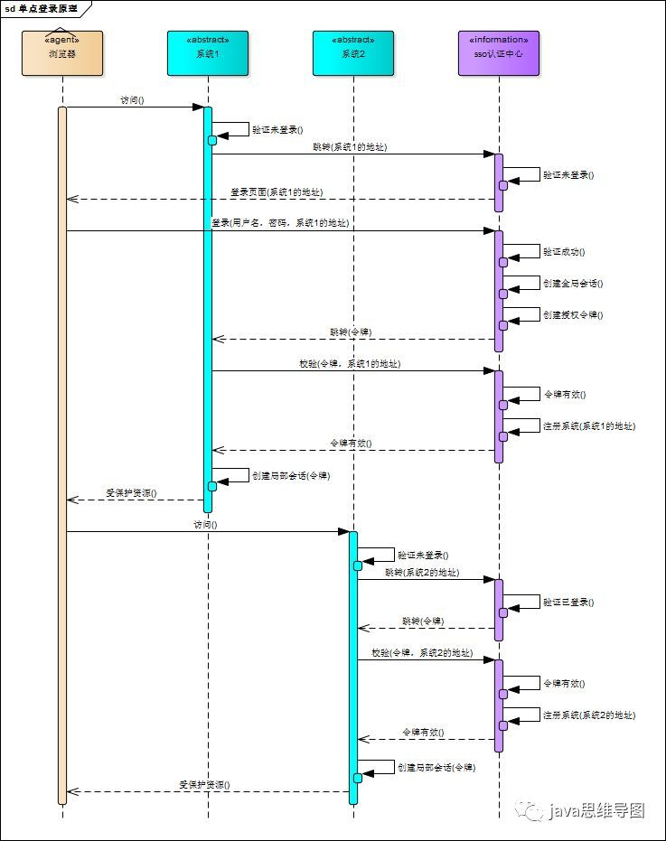
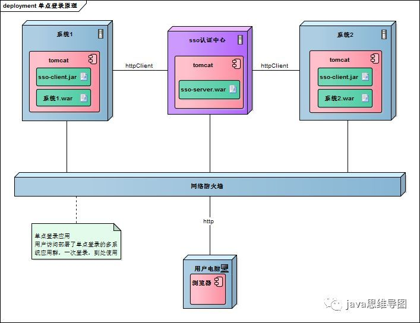

# 单点登录

单点登录（Single Sign On），简称为 SSO，是目前比较流行的企业业务整合的解决方案之一

SSO的定义是在多个应用系统中，用户只需要登录一次就可以访问所有相互信任的应用系统

SSO 一般都需要一个独立的认证中心（passport），子系统的登录均得通过passport，子系统本身将不参与登录操作

当一个系统成功登录以后，passport将会颁发一个令牌给各个子系统，子系统可以拿着令牌会获取各自的受保护资源，为了减少频繁认证，各个子系统在被passport授权以后，会建立一个局部会话，在一定时间内可以无需再次向passport发起认证

#### 1、登录

相比于单系统登录，sso需要一个独立的认证中心，只有认证中心能接受用户的用户名密码等安全信息，其他系统不提供登录入口，只接受认证中心的间接授权。间接授权通过令牌实现，sso认证中心验证用户的用户名密码没问题，创建授权令牌，在接下来的跳转过程中，授权令牌作为参数发送给各个子系统，子系统拿到令牌，即得到了授权，可以借此创建局部会话，局部会话登录方式与单系统的登录方式相同。这个过程，也就是单点登录的原理，用下图说明

下面对上图简要描述

- 用户访问系统1的受保护资源，系统1发现用户未登录，跳转至sso认证中心，并将自己的地址作为参数
- sso认证中心发现用户未登录，将用户引导至登录页面
- 用户输入用户名密码提交登录申请
- sso认证中心校验用户信息，创建用户与sso认证中心之间的会话，称为全局会话，同时创建授权令牌
- sso认证中心带着令牌跳转会最初的请求地址（系统1）
- 系统1拿到令牌，去sso认证中心校验令牌是否有效
- sso认证中心校验令牌，返回有效，注册系统1
- 系统1使用该令牌创建与用户的会话，称为局部会话，返回受保护资源
- 用户访问系统2的受保护资源
- 系统2发现用户未登录，跳转至sso认证中心，并将自己的地址作为参数
- sso认证中心发现用户已登录，跳转回系统2的地址，并附上令牌
- 系统2拿到令牌，去sso认证中心校验令牌是否有效
- sso认证中心校验令牌，返回有效，注册系统2
- 系统2使用该令牌创建与用户的局部会话，返回受保护资源

　　用户登录成功之后，会与sso认证中心及各个子系统建立会话，用户与sso认证中心建立的会话称为全局会话，用户与各个子系统建立的会话称为局部会话，局部会话建立之后，用户访问子系统受保护资源将不再通过sso认证中心，全局会话与局部会话有如下约束关系

- 局部会话存在，全局会话一定存在
- 全局会话存在，局部会话不一定存在
- 全局会话销毁，局部会话必须销毁

### 部署图

单点登录涉及sso认证中心与众子系统，子系统与sso认证中心需要通信以交换令牌、校验令牌及发起注销请求，因而子系统必须集成sso的客户端，sso认证中心则是sso服务端，整个单点登录过程实质是sso客户端与服务端通信的过程，用下图描述

sso认证中心与sso客户端通信方式有多种，这里以简单好用的httpClient为例，web service、rpc、restful api都可以